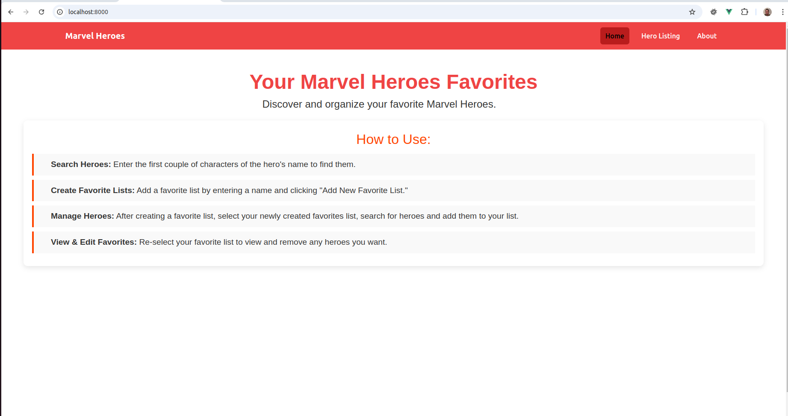
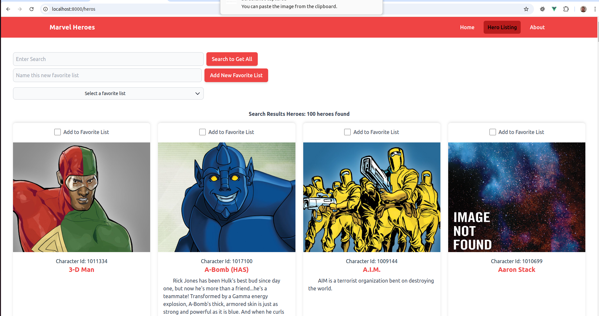
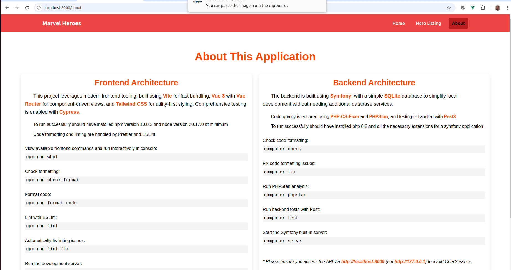

# Heros Application

V2 is running at http://3.144.142.248/

- This is version v1-slowfetch branch
- Recommended to run v2-localcache for a much more responsive web application

Recommended to run v2-localcache for a much more responsive web application v2 addresses sometimes slow api responses from marvel API.

https://github.com/PaulNovack/symfony-vue3-heros/tree/v2-localcache

Open in  browser: http://localhost:8000 !!

NOT!  http://127.0.0.1:8000

To install this application clone the repo

You should be running php 8.2 with all extensions required to run a symfony application for help see symfony documentation

You should be running close to npm 10.8.2 and node v20.17.0 not tested on other versions.

To simplify set up this simply uses sqlite3 so no database set up is needed.

To run the application put a marvel api key in the .env file first

run cp .env.example .env  and then fill in the keys.

Open 2 terminals at root of application

Terminal 1:
run: npm update

run: cd tools/php-cs-fixer

run: npm update

run: cd ../../

then run: npm run dev

this will serve front end and compile assets

Terminal 2:

run: composer update

run: php bin/console make:migration

run: php bin/console doctrine:migrations:migrate

then run: composer serve

#### Using these commands to start the front and back ensures the application is running on correct ports to communicate!!

### Make sure to access the application from http://localhost:8000/ and not http://127.0.0.1:8000 or you will get CORS errors!

#### The about page of the application lists some helpful developer commands for formatting, linting and running tests.
Home

Heros

About

